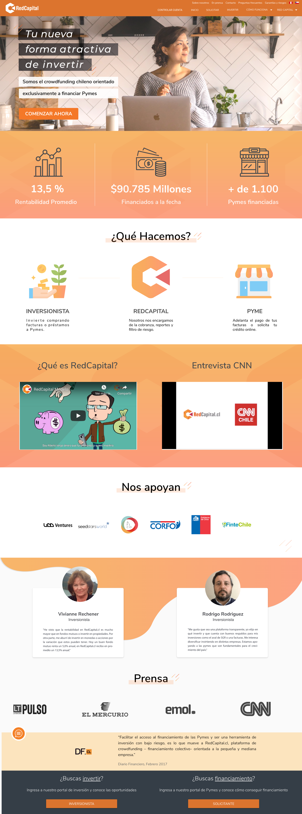

# Proyecto RedCapital

Generación de Landing Page 100% Responsive  desde un mockUp basado en AdobeXD, desarrollado con:

  - HTML5
  - CSS3 
  - Materialize CSS
  - JavaScript
  - Clases de CSS con gradiant, flexbox
  - material grid
  

# MockUp Base

# Resultado final

El resultado final lo puedes visualizar en este link.

https://josefaherreras.github.io/web-capital-materialize-css/ 
